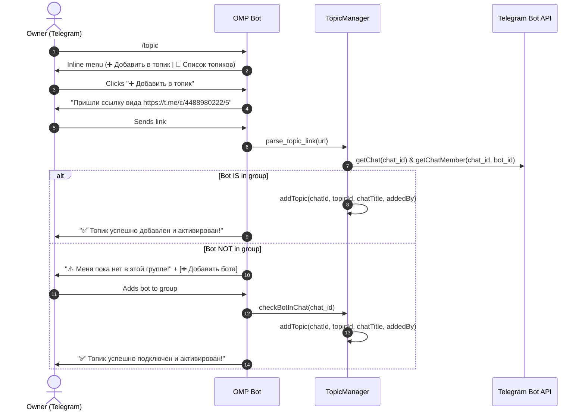

# Telegram Topic & Forum Thread Management Skill

This skill defines the architecture, workflow, and operations for connecting OMP Telegram Bot to specific Telegram forum topics (supergroup threads) and managing active chat routing.

---

## 1. Overview & Architecture

When OMP Bot is added to a Telegram supergroup with Forums/Topics enabled, it must **not** spam in general or unconfigured threads. It uses targeted routing via `message_thread_id` and the `/topic` management interface.

### Core Components:
- **`src/services/topics.ts` (`TopicManager`)**:
  - Manages persistent active topic registry in `~/.omp/active_topics.json`.
  - Validates and normalizes internal Telegram topic URLs (`https://t.me/c/<chat_num>/<topic_id>`).
  - Checks bot membership and admin privileges via Telegram Bot API (`getChat` & `getChatMember`).
- **`src/bot/handlers.ts`**:
  - Interactive command `/topic` with Inline Keyboards (`➕ Добавить в топик`, `📑 Список топиков`, `🗑 Отключить`).
  - Direct command support: `/topic add <url>`, `/topic list`, `/topic remove <chat_id>:<topic_id>`, and `/topic enable` directly in group threads.
- **`src/bot/middlewares.ts`**:
  - Enforces private chat authorization for allowed users while dynamically allowing group messages strictly within registered active topics.
- **`src/services/streamer.ts` (`TelegramStreamConsumer`)**:
  - Routes real-time token streaming, edits, photos, stickers, and reactions precisely into `message_thread_id`.

---

## 2. Supported Link Formats & Parsing Rules

Telegram internal forum links use the format:
```text
https://t.me/c/<chat_num>/<topic_id>
```

### Normalization Logic:
1. Extract `<chat_num>` and `<topic_id>` using regex: `t.me/c/(\d+)/(\d+)`.
2. Convert `<chat_num>` into a 64-bit Telegram Bot API supergroup `chat_id`:
   - If `<chat_num>` does NOT start with `100`: `chat_id = -100<chat_num>`
   - If `<chat_num>` starts with `100`: `chat_id = -<chat_num>`
3. Example:
   - Input: `https://t.me/c/4488980222/5`
   - Result: `chat_id = -1004488980222`, `topic_id = 5`

---

## 3. Interactive Connection & Verification Workflow



---

## 4. Message Thread Isolation Rules

1. **Filtering in Groups:**
   - In any `group` or `supergroup`, if `topicManager.isTopicActive(message.chat.id, message.message_thread_id)` returns `false`, the bot **silently drops** the update.
   - If `true`, the bot processes the message with full OMP agent capabilities (streaming, file access, tools, reactions).

2. **Responses:**
   - Every outgoing message, tool edit, sticker, or reaction MUST specify `message_thread_id=message.message_thread_id`.
